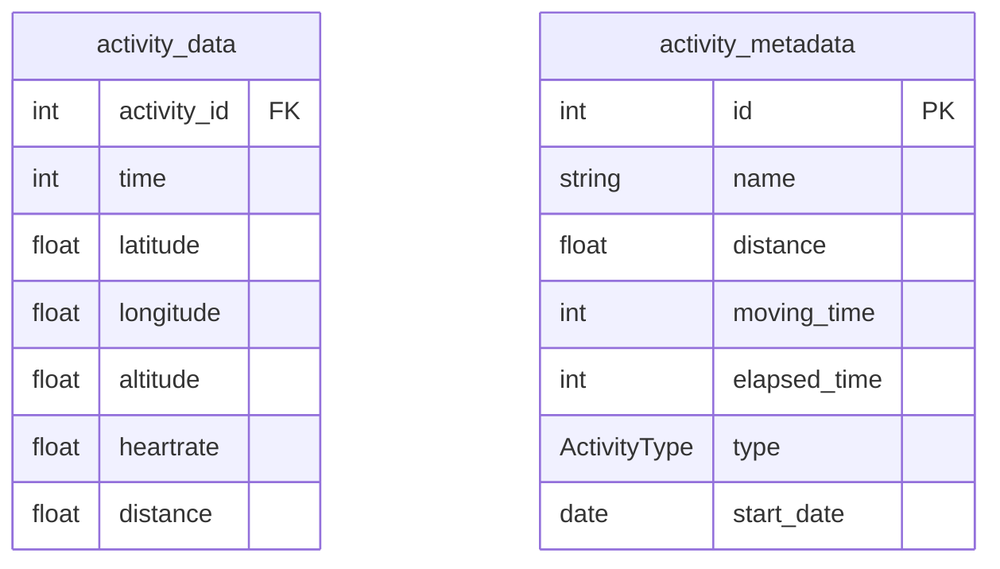

# Hermes

Hermes handels the ingestion of data into the application from external sources such as Strava, Garmin Connect or others. It should implement a framework that makes it easy to add a sources with features such as delta-load, database ingestion, execution, loading of configs and secrets out of the box.  

----

Todo list:
[ ] Config loading
[ ] Strava intergration
[ ] Garmin intergration

## Learning Objectives

[ ] Work with Polars
[ ] Become better at writing async code
[ ] Learn to measure performance
[ ] learn to increase performance (focus on async)

`docker run -d --name timescaledb -p 127.0.0.1:5432:5432 -e POSTGRES_PASSWORD=password timescale/timescaledb:latest-pg14`

Database design

